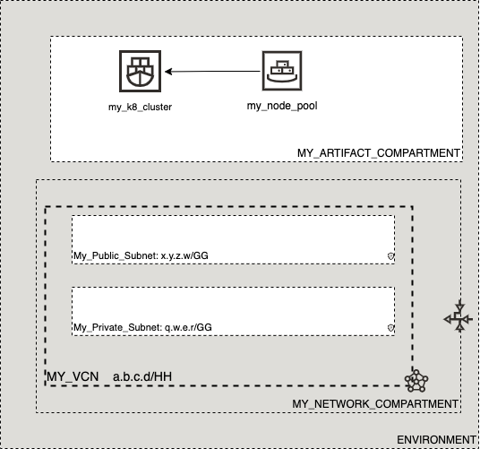

# OCI Cloud Bricks: Oracle Container (Kubernetes) Engine (OKE) - Node Pool

[](https://img.shields.io/badge/license-UPL-green) [](https://sonarcloud.io/dashboard?id=oracle-devrel_terraform-oci-cloudbricks-oke-nodepool)

## Introduction
The following cloud brick enables you to create a decoupled Oracle Kubernetes Engine Nodepool associated to a particular OKE Cluster

## Reference Architecure
The following is the reference architecture associated to this brick.



In this case you can take advantage of the decoupled nature of this module and provision as many nodepools as required. You later on can use node affinity to have different types of workload based nodepools (such as GPU enabled ones)

### Prerequisites
- Pre existent OKE Cluster

---

## Sample tfvar file

If Flex shape is in use


```shell
########## FLEX SHAPE IN USE ##########
########## SAMPLE TFVAR FILE ##########
########## PROVIDER SPECIFIC VARIABLES ##########
region           = "foo-region-1"
tenancy_ocid     = "ocid1.tenancy.oc1..abcdefg"
user_ocid        = "ocid1.user.oc1..aaaaaaabcdefg"
fingerprint      = "fo:oo:ba:ar:ba:ar"
private_key_path = "/absolute/path/to/api/key/your_api_key.pem"
########## PROVIDER SPECIFIC VARIABLES ##########

########## ARTIFACT SPECIFIC VARIABLES ##########
ssh_public_key                      = "/path/to/public/ssh/key/pub_key"
ssh_private_key                     = "/path/to/public/ssh/key/priv_key"
ssh_public_is_path                  = true
ssh_private_is_path                 = true
oke_cluster_compartment_name        = "MY_ARTIFACT_COMPARTMENT"
oke_network_compartment_name        = "MY_NETWORK_COMPARTMENT"
oke_availability_domain_map         = { "ad1" : "aBCD:foo-REGION-1-AD-1", "ad2" : "aBCD:foo-REGION-1-AD-2" , "ad2" : "aBCD:foo-REGION-1-AD-3" }
oke_cluster_name                    = "my_k8_cluster"
oke_nodepool_network_subnet_name    = "node_pool_subnet"
k8s_version                         = "K8_Version"
node_pool_name                      = "my_node_pool"
node_pool_shape                     = "VM.Standard.E4.Flex"
is_flex_shape                       = true
nodepool_shape_config_ocpus         = 1
nodepool_shape_config_memory_in_gbs = 16
number_of_nodes                     = 3
k8s_label_map                    = { "SampleLabel1" : "SomeText", "SampleLabel1" : "AnotherText" }
########## ARTIFACT SPECIFIC VARIABLES ##########
########## SAMPLE TFVAR FILE ##########
########## FLEX SHAPE IN USE ##########
```

If Flex shape is not in use

```shell
########## FLEX SHAPE NOT IN USE ##########
########## SAMPLE TFVAR FILE ##########
########## PROVIDER SPECIFIC VARIABLES ##########
region           = "foo-region-1"
tenancy_ocid     = "ocid1.tenancy.oc1..abcdefg"
user_ocid        = "ocid1.user.oc1..aaaaaaabcdefg"
fingerprint      = "fo:oo:ba:ar:ba:ar"
private_key_path = "/absolute/path/to/api/key/your_api_key.pem"
########## PROVIDER SPECIFIC VARIABLES ##########

########## ARTIFACT SPECIFIC VARIABLES ##########
ssh_public_key                   = "/path/to/public/ssh/key/pub_key"
ssh_private_key                  = "/path/to/public/ssh/key/priv_key"
ssh_public_is_path               = true
ssh_private_is_path              = true
oke_cluster_compartment_name     = "MY_ARTIFACT_COMPARTMENT"
oke_network_compartment_name     = "MY_NETWORK_COMPARTMENT"
oke_availability_domain_map      = { "ad1" : "aBCD:foo-REGION-1-AD-1", "ad2" : "aBCD:foo-REGION-1-AD-2" , "ad2" : "aBCD:foo-REGION-1-AD-3" }
oke_cluster_name                 = "my_k8_cluster"
oke_nodepool_network_subnet_name = "node_pool_subnet"
k8s_version                      = "K8_Version"
node_pool_name                   = "my_node_pool"
node_pool_shape                  = "VM.Standard2.1"
number_of_nodes                  = 5
k8s_label_map                    = { "SampleLabel1" : "SomeText", "SampleLabel1" : "AnotherText" }
########## ARTIFACT SPECIFIC VARIABLES ##########
########## SAMPLE TFVAR FILE ##########
########## FLEX SHAPE NOT IN USE ##########
```


### Variable specific considerations
- You can couple as many nodepools as required
- Variables `ssh_public_is_path` and `ssh_private_is_path` should always be set to `true` if the keys are using a full or relative path. If you hard code this as variable, then turn them to `false`
- Variable `oke_cluster_name` should be the display name of corresponding cluster. If using a modular coupled approach, this name can be obtained from OKE module output
- Variable `oke_nodepool_network_subnet_name` should be the subnet where the nodepool will be created. If the nodepool is required to be kept private, then subnet must be private too
- Variable `k8s_version` should be passed on following standard `v1.xx.yy`. For currently supported versions, please refer to the [following link](https://docs.oracle.com/en-us/iaas/Content/ContEng/Concepts/contengaboutk8sversions.htm)
- If using flex shapes, consider using the correct tfvars file definition
- Always prefer using nodepool size in odd number 

---

## Sample provider
The following is the base provider definition to be used with this module

```shell
terraform {
  required_version = ">= 0.13.5"
}
provider "oci" {
  region       = var.region
  tenancy_ocid = var.tenancy_ocid
  user_ocid        = var.user_ocid
  fingerprint      = var.fingerprint
  private_key_path = var.private_key_path
  disable_auto_retries = "true"
}

provider "oci" {
  alias        = "home"
  region       = data.oci_identity_region_subscriptions.home_region_subscriptions.region_subscriptions[0].region_name
  tenancy_ocid = var.tenancy_ocid  
  user_ocid        = var.user_ocid
  fingerprint      = var.fingerprint
  private_key_path = var.private_key_path
  disable_auto_retries = "true"
}
```
---

## Variable documentation
## Requirements

| Name | Version |
|------|---------|
| <a name="requirement_terraform"></a> [terraform](#requirement\_terraform) | >= 0.13.5 |

## Providers

| Name | Version |
|------|---------|
| <a name="provider_oci"></a> [oci](#provider\_oci) | 4.36.0 |
| <a name="provider_oci.home"></a> [oci.home](#provider\_oci.home) | 4.36.0 |
| <a name="provider_random"></a> [random](#provider\_random) | 3.1.0 |

## Modules

No modules.

## Resources

| Name | Type |
|------|------|
| [oci_containerengine_node_pool.oke_node_pool](https://registry.terraform.io/providers/hashicorp/oci/latest/docs/resources/containerengine_node_pool) | resource |
| [oci_identity_tag.release](https://registry.terraform.io/providers/hashicorp/oci/latest/docs/resources/identity_tag) | resource |
| [oci_identity_tag_namespace.devrel](https://registry.terraform.io/providers/hashicorp/oci/latest/docs/resources/identity_tag_namespace) | resource |
| [random_id.tag](https://registry.terraform.io/providers/hashicorp/random/latest/docs/resources/id) | resource |
| [oci_containerengine_clusters.OKECLUSTERS](https://registry.terraform.io/providers/hashicorp/oci/latest/docs/data-sources/containerengine_clusters) | data source |
| [oci_core_images.OL79](https://registry.terraform.io/providers/hashicorp/oci/latest/docs/data-sources/core_images) | data source |
| [oci_core_subnets.NODEPOOLSUBNET](https://registry.terraform.io/providers/hashicorp/oci/latest/docs/data-sources/core_subnets) | data source |
| [oci_core_vcns.VCN](https://registry.terraform.io/providers/hashicorp/oci/latest/docs/data-sources/core_vcns) | data source |
| [oci_identity_compartments.COMPARTMENTS](https://registry.terraform.io/providers/hashicorp/oci/latest/docs/data-sources/identity_compartments) | data source |
| [oci_identity_compartments.NWCOMPARTMENTS](https://registry.terraform.io/providers/hashicorp/oci/latest/docs/data-sources/identity_compartments) | data source |
| [oci_identity_region_subscriptions.home_region_subscriptions](https://registry.terraform.io/providers/hashicorp/oci/latest/docs/data-sources/identity_region_subscriptions) | data source |

## Inputs

| Name | Description | Type | Default | Required |
|------|-------------|------|---------|:--------:|
| <a name="input_fingerprint"></a> [fingerprint](#input\_fingerprint) | API Key Fingerprint for user\_ocid derived from public API Key imported in OCI User config | `any` | n/a | yes |
| <a name="input_is_flex_shape"></a> [is\_flex\_shape](#input\_is\_flex\_shape) | Boolean that describes if the shape is flex or not | `bool` | `false` | no |
| <a name="input_k8s_label_map"></a> [k8s\_label\_map](#input\_k8s\_label\_map) | Define the list of Kubernetes Labels to apply in nodepool | `map(any)` | n/a | yes |
| <a name="input_k8s_version"></a> [k8s\_version](#input\_k8s\_version) | Declares K8 Version | `any` | n/a | yes |
| <a name="input_node_metadata"></a> [node\_metadata](#input\_node\_metadata) | A list of key/value pairs to add to each underlying Oracle Cloud Infrastructure nodepool in the node pool on launch. | `map(any)` | `{}` | no |
| <a name="input_node_pool_name"></a> [node\_pool\_name](#input\_node\_pool\_name) | Node Pool Name for K8 Cluster | `any` | n/a | yes |
| <a name="input_node_pool_shape"></a> [node\_pool\_shape](#input\_node\_pool\_shape) | Shape to be used in node pool members | `any` | n/a | yes |
| <a name="input_nodepool_shape_config_memory_in_gbs"></a> [nodepool\_shape\_config\_memory\_in\_gbs](#input\_nodepool\_shape\_config\_memory\_in\_gbs) | (Updatable) The total amount of memory available to the nodepool, in gigabytes. | `string` | `""` | no |
| <a name="input_nodepool_shape_config_ocpus"></a> [nodepool\_shape\_config\_ocpus](#input\_nodepool\_shape\_config\_ocpus) | (Updatable) The total number of OCPUs available to the nodepool. | `string` | `""` | no |
| <a name="input_number_of_nodes"></a> [number\_of\_nodes](#input\_number\_of\_nodes) | Number of Nodes inside Node Pool | `any` | n/a | yes |
| <a name="input_oke_availability_domain_map"></a> [oke\_availability\_domain\_map](#input\_oke\_availability\_domain\_map) | The name of the availability domain in which this node is placed | `map(any)` | n/a | yes |
| <a name="input_oke_cluster_compartment_id"></a> [oke\_cluster\_compartment\_id](#input\_oke\_cluster\_compartment\_id) | Defines the compartment OCID where the OKE cluster was created | `string` | `""` | no |
| <a name="input_oke_cluster_compartment_name"></a> [oke\_cluster\_compartment\_name](#input\_oke\_cluster\_compartment\_name) | Defines the compartment name where the OKE cluster was created | `string` | `""` | no |
| <a name="input_oke_cluster_name"></a> [oke\_cluster\_name](#input\_oke\_cluster\_name) | OKE cluster display name | `any` | n/a | yes |
| <a name="input_oke_network_compartment_name"></a> [oke\_network\_compartment\_name](#input\_oke\_network\_compartment\_name) | Defines the compartment where the Network is currently located | `any` | n/a | yes |
| <a name="input_oke_nodepool_compartment_id"></a> [oke\_nodepool\_compartment\_id](#input\_oke\_nodepool\_compartment\_id) | Defines the compartment OCID where the OKE nodepool is created | `string` | `""` | no |
| <a name="input_oke_nodepool_compartment_name"></a> [oke\_nodepool\_compartment\_name](#input\_oke\_nodepool\_compartment\_name) | Defines the compartment name where the OKE nodepool is created | `string` | `""` | no |
| <a name="input_oke_nodepool_network_subnet_name"></a> [oke\_nodepool\_network\_subnet\_name](#input\_oke\_nodepool\_network\_subnet\_name) | Defines the specific Subnet to be used for this resource | `any` | n/a | yes |
| <a name="input_private_key_path"></a> [private\_key\_path](#input\_private\_key\_path) | Private Key Absolute path location where terraform is executed | `any` | n/a | yes |
| <a name="input_region"></a> [region](#input\_region) | Target region where artifacts are going to be created | `any` | n/a | yes |
| <a name="input_source_type"></a> [source\_type](#input\_source\_type) | The source type of this option. IMAGE means the OCID is of an image | `string` | `"IMAGE"` | no |
| <a name="input_ssh_private_is_path"></a> [ssh\_private\_is\_path](#input\_ssh\_private\_is\_path) | Describes if SSH Private Key is located on file or inside code | `bool` | `false` | no |
| <a name="input_ssh_private_key"></a> [ssh\_private\_key](#input\_ssh\_private\_key) | Private key to log into machine | `any` | n/a | yes |
| <a name="input_ssh_public_is_path"></a> [ssh\_public\_is\_path](#input\_ssh\_public\_is\_path) | Describes if SSH Public Key is located on file or inside code | `bool` | `false` | no |
| <a name="input_ssh_public_key"></a> [ssh\_public\_key](#input\_ssh\_public\_key) | Defines SSH Public Key to be used in order to remotely connect to compute nodepool | `string` | n/a | yes |
| <a name="input_tenancy_ocid"></a> [tenancy\_ocid](#input\_tenancy\_ocid) | OCID of tenancy | `any` | n/a | yes |
| <a name="input_user_ocid"></a> [user\_ocid](#input\_user\_ocid) | User OCID in tenancy. Currently hardcoded to user denny.alquinta@oracle.com | `any` | n/a | yes |

## Outputs

| Name | Description |
|------|-------------|
| <a name="output_node_details"></a> [node\_details](#output\_node\_details) | Node Pool Member Details |
| <a name="output_node_pool"></a> [node\_pool](#output\_node\_pool) | Node pool details |
| <a name="output_oke_nodepools"></a> [oke\_nodepools](#output\_oke\_nodepools) | Node Pools configured inside OKE |


## Contributing
This project is open source.  Please submit your contributions by forking this repository and submitting a pull request!  Oracle appreciates any contributions that are made by the open source community.

## License
Copyright (c) 2021 Oracle and/or its affiliates.

Licensed under the Universal Permissive License (UPL), Version 1.0.

See [LICENSE](LICENSE) for more details.
